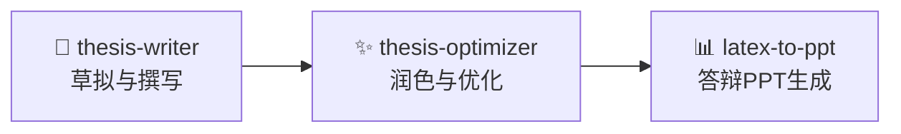

<div align="center">
  <h1>🎓 Leo-Skill: 学术论文 Agent 工具箱</h1>
  <p>专为计算机（尤其是深度学习）硕士学位论文设计的全生命周期智能撰写、优化与答辩辅助工具箱。</p>
  
  [](https://github.com/Haimbeau1o/leo-skill/blob/main/LICENSE)
</div>

## 🌟 项目概览

**Leo-Skill** 是一个聚合了高品质学术类 AI Agent 技能的开源工具箱。它能够覆盖硕士学位论文的完整生命周期：从前期的选题设计、大纲规划与正文撰写，到中后期的 AI 痕迹抹除、查重优化，再到最终答辩PPT的结构化生成。

本项目包含了核心的撰写与演示生成技能，并无缝链接至我们的旗舰级论文优化系统。

---

## 🔄 最佳实践工作流 (Best Practice Workflow)

通过我们提供的 Agent 生态，仅需三步即可打造高质量的学位论文：



1. **从 0 到 1 撰写 (Drafting)**：使用 `thesis-writer` 智能生成符合规范的大纲、搜集相关工作并辅助各章节的内容填充。
2. **论文质量打磨 (Optimization)**：使用 `thesis-optimizer` 有效降低 AI 生成检测率、降低知网/维普的查重相似度，并实现学术语气的全面润色提升。
3. **答辩从容应对 (Presentation)**：将最终定稿的 LaTeX 源码交给 `latex-to-ppt`，一键提炼出 20-30 页结构完美的答辩 Markdown 脚本（可直接无缝导入 Gamma, Kimi, 或 Beautiful.ai 等工具）。

---

## 📦 技能目录 (Skills Directory)

本项目将各个 Agent 技能直接置于根目录，方便您的 AI 助手一键挂载读取。

### 1. 📝 Thesis-Writer
*计算机/深度学习方向硕士学位论文智能撰写系统*
- **核心功能**：结合标准学术 LaTeX 模板生成大纲框架，辅助选题定位，开展相关工作调研梳理，并引导核心方法与实验章节的规范写作。
- **目录位置**：[`/thesis-writer`](./thesis-writer)

### 2. ✨ Thesis-Optimizer (外部旗舰套件)
*三维一体的智能学术论文优化系统*
- **核心功能**：专注于学术论文的后期打磨，采用“总揽+章节”两级状态追踪架构，实现“降AI率”、“降查重率”、“学术化润色”的闭环协同进化。
- **🔗 获取指南**：作为核心专业工具，这部分能力放置于独立的专有仓库中。请访问获取：**[Haimbeau1o/thesis-optimizer](https://github.com/Haimbeau1o/thesis-optimizer)**

### 3. 📊 LaTeX-to-PPT
*从严肃的 LaTeX 论文到结构化的演示文档生成器*
- **核心功能**：自动解析具备复杂排版的 LaTeX 手稿，提取问题动机、核心方法（公式与架构）和实验证明，归纳提炼出专为学术答辩打造的 20-30 页精炼演示脚本（Markdown 格式）。
- **目录位置**：[`/latex-to-ppt`](./latex-to-ppt)

### 4. 🔍 Find-Skills
*生态专属技能发现与引导工具*
- **核心功能**：辅佐主系统，帮助开发者或研究人员从浩瀚的开源 Agent 生态中探索、发现和安装其他细分领域的实用技能（如代码开发、DevOps 部署、UI 设计等）。
- **目录位置**：[`/find-skills`](./find-skills)
- **致谢与来源**：本工具的设计理念与实现灵感来源于 Vercel Engineering 和 ComposioHQ 的卓越开源 Agent 生态系统，特此致敬。

---

## 🚀 安装与使用指南

您可以将这些本地技能非常容易地接入到您的 AI Agent 工作流中：

### 使用 Skills CLI (推荐给开发者)
如果您的 Agent 支持标准的技能包规范协议，您可以这样引入：
```bash
# 安装论文撰写辅助系统
npx skills add Haimbeau1o/leo-skill@thesis-writer

# 安装答辩 PPT 转换工具
npx skills add Haimbeau1o/leo-skill@latex-to-ppt
```

### 本地加载 (最通用方式)
只需指令您的 AI 助手（如 Cursor、豆包、Claude 或 ChatGPT）直接读取每个技能目录下的 `SKILL.md` 文件，即可马上赋予它这方面的超级能力。

```text
# 在与 AI 的对话框中直接下发指令（示例）：
"请首先阅读并知悉本项目 ./thesis-writer/SKILL.md 中的方法论，然后基于它的流程指导我书写论文绪论。"
```

## 🤝 参与贡献
我们非常期待并欢迎您的提交修改、反馈问题 (Issues)或提交特性需求。
让我们一起为科研写作效率的提升而努力！

---
*Built with ❤️ for better academic research and writing efficiency.*
