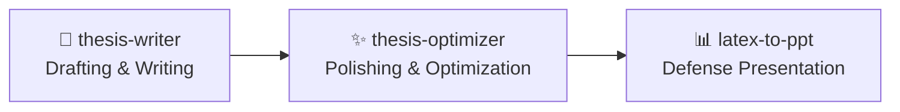

<div align="center">
  <h1>🎓 Leo-Skill: Academic Thesis Agent Toolkit</h1>
  <p>An intelligent agent toolkit for full-lifecycle Master's thesis writing, optimization, and presentation.</p>
  
  [](https://github.com/Haimbeau1o/leo-skill/blob/main/LICENSE)
</div>

## 🌟 Overview

**Leo-Skill** is a comprehensive suite of AI Agent skills specifically designed to assist computer science students (especially in deep learning) across the entire lifecycle of their Master's thesis. From topic selection and writing, to polishing and plagiarism reduction, all the way to generating defense presentation slides.

This repository hosts the core writing and presentation skills, and integrates seamlessly with our flagship optimization tool.

---

## 🔄 The Best Practice Workflow

Achieve a high-quality thesis in three seamless steps using our agent ecosystem:



1. **Drafting (From 0 to 1)**: Use `thesis-writer` to generate outlines, fill chapters, and summarize related work.
2. **Optimization (Quality Assurance)**: Use `thesis-optimizer` to reduce AI detection rates, lower plagiarism (查重), and polish academic tone.
3. **Presentation (Defense Ready)**: Run your final LaTeX through `latex-to-ppt` to generate a 20-30 slide structured presentation ready for Gamma, Kimi, or Beautiful.ai.

---

## 📦 Skills Directory

### 1. 📝 Thesis-Writer
*Intelligent thesis writing system for CS/Deep Learning.*
- **Features**: Generates outlines based on standard academic LaTeX templates, aids in topic selection, conducts related work surveys, and orchestrates the drafting of core chapters.
- **Location**: [`/skills/thesis-writer`](./skills/thesis-writer)

### 2. ✨ Thesis-Optimizer (External Suite)
*Three-dimensional intelligent optimization system.*
- **Features**: Specialized in lowering AI-generation detection rates, reducing plagiarism similarity scores, and enhancing academic phraseology using a two-tier document state-tracking architecture.
- **🔗 Guide & Installation**: This is our flagship specialized tool. Please visit the dedicated repository to use it: **[Haimbeau1o/thesis-optimizer](https://github.com/Haimbeau1o/thesis-optimizer)**

### 3. 📊 LaTeX-to-PPT
*LaTeX to structured presentation generator.*
- **Features**: Automatically parses complex LaTeX manuscripts and distills them into perfect 20-30 slide presentation scripts (Markdown) tailored for academic defenses.
- **Location**: [`/skills/latex-to-ppt`](./skills/latex-to-ppt)

### 4. 🔍 Find-Skills
*Ecosystem skill discovery tool.*
- **Features**: Helps you explore and install other specialized agent skills (like Web Development, DevOps, Design) from the open ecosystem.
- **Location**: [`/skills/find-skills`](./skills/find-skills)
- **Acknowledgments & Origin**: This tool concept originates from and pays tribute to the open AI agent ecosystem, specifically adapting the `npx skills` package manager concepts from pioneering platforms like Vercel Engineering and ComposioHQ.

---

## 🚀 Installation & Usage

You can seamlessly install any of these local skills into your agent working environment.

### Using Skills CLI
If your agent supports standard skill package management:
```bash
# Add thesis-writer
npx skills add Haimbeau1o/leo-skill@thesis-writer

# Add latex-to-ppt
npx skills add Haimbeau1o/leo-skill@latex-to-ppt
```

### Manual Usage
Simply point your AI Agent / LLM to read the `SKILL.md` file within each skill's designated directory to activate its capabilities.

```bash
# Example for a local assistant
"Please read ./skills/thesis-writer/SKILL.md and help me write my introduction."
```

## 🤝 Contributing
Contributions, issues, and feature requests are welcome! Feel free to check the [issues page](https://github.com/Haimbeau1o/leo-skill/issues).

---
*Built with ❤️ for better academic research and writing efficiency.*
