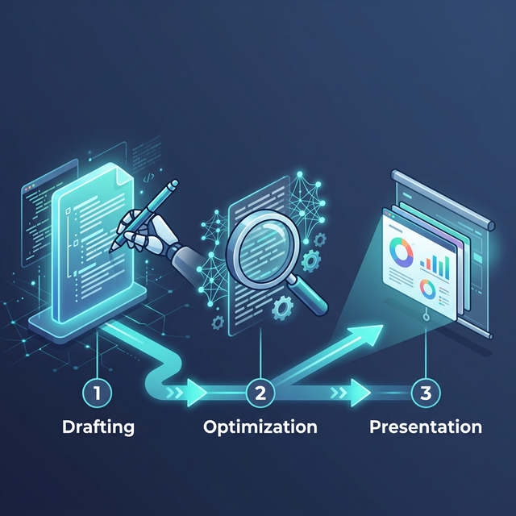

# 🎓 Leo-Skill: 计算机硕士学位论文智能工作流指南


## 📌 写在前言 (Foreword)

各位计算机科学与深度学习方向的研究生们，你们好！

学位论文的撰写往往是一场持久战：从开题时的茫然、相关工作调研的繁琐、到正文推导的逻辑编排，再到最后查重降重和答辩 PPT 的制作，每一步都考验着我们的精力和耐心。

**Leo-Skill** 正是为此而生！这是一个专为我们学科量身定制的**全生命周期 AI Agent 工具箱**。它不是单纯的“一键生成器”，而是你最专业的“学术副驾驶”。通过合理的模块化拆解和专业 Prompt 引导，它能帮助你：

- **高效重构**：将零散的实验数据和思路提炼成符合学术规范的段落。
- **降本增效**：自动处理查重降重、AI 痕迹擦除等机械性工作。
- **完美落幕**：在答辩前夕，一键将晦涩的 LaTeX 源码转换为结构清晰、极具表现力的答辩演示文稿。

---

## 🧭 工作流全景图 (Workflow)

整个学术写作的生命周期被我们拆解为三个标准化、模块化的阶段。你可以随时在终端无缝调用这些能力：



### 阶段 1：📝 从 0 到 1 草拟与撰写 (`thesis-writer`)
在这个阶段，你只需要提供你的实验数据、大概的方法思路，或者几篇核心参考文献。
- **作用**：引导选题、生成大纲、构建“相关工作”的对比分析、辅助核心方法与实验分析的结构化写作。
- **调用方式**：在 AI 交互界面中指出你需要帮助的章节，让 `thesis-writer` 带领你逐步完成初稿。

### 阶段 2：✨ 论文质量打磨与优化 (`thesis-optimizer`)
文章写完后查重率过高？被导师指出“AI 味儿太重”？
- **作用**：这是一个外部的三维一体专业优化套件。它采用“总揽+章节”两级状态追踪，通过多轮迭代帮你**降 AI 率、降查重率**，并进行学术语言润色。
- **获取方式**：请访问主页获取 [Haimbeau1o/thesis-optimizer](https://github.com/Haimbeau1o/thesis-optimizer) 套件。

### 阶段 3：📊 答辩从容应对 (`latex-to-ppt`)
论文定稿了，答辩在即，面对几十页的 LaTeX 代码无从下手？
- **作用**：自动解析你的 `.tex` 源码，提取研究动机、模块架构（如 MV-FDE、SAM 等具体设计）、核心公式、主实验结果与消融实验。
- **输出**：生成一份 20-30 页的结构化 Markdown 脚本。你可以直接将它粘贴到 **Gamma**、**Kimi** 或 **Beautiful.ai** 中，1分钟生成华丽的答辩 Slides。

---

## 🚀 核心能力如何调用？

你可以通过以下两种方式将这些技能挂载到你的 AI Agent（如 Cursor, Windsurf, Claude Code 等）中。

### 方式 1：本地加载 (最通用方式)
这是最简单、最通用的方式。只需要让你的 AI 助手直接读取对应目录下 `SKILL.md` 这个“魔法文件”，它就会立刻掌握该项超能力：

> **💡 快速挂载指令示例**：
> "请首先阅读并知悉 `@[./leo-skill/thesis-writer/SKILL.md]` 中的方法论，帮我构思一下第三章的方法介绍。"
> 
> "请使用 `@[./leo-skill/latex-to-ppt/SKILL.md]` 提取 `@[./thesis.tex]` 的内容，为我生成答辩 PPT 的 Markdown 大纲。"

### 方式 2：使用 Skills CLI (推荐给资深开发者)
如果你的系统支持标准的 Skills CLI（例如 Claude Code），你可以通过 `npx skills` 直接作为全局能力引入：

```bash
# 安装论文撰写辅助系统
npx skills add Haimbeau1o/leo-skill@thesis-writer

# 安装答辩 PPT 转换工具
npx skills add Haimbeau1o/leo-skill@latex-to-ppt
```

**快速索引与目录对应表**：
| 技能名称 | 适用阶段 | 所在目录 |
| :--- | :--- | :--- |
| **Thesis-Writer** | 前期规划与正文撰写 | `./thesis-writer/` |
| **LaTeX-to-PPT** | 终期答辩演示生成 | `./latex-to-ppt/` |
| **Find-Skills** | 探索与扩展 | `./find-skills/` |

---

## 🌐 生态扩展：不仅仅是论文

除了写作，研究生阶段你可能会遇到各种杂活：搭建个人主页、编写后端脚本、甚至处理杂乱的数据格式。

为了解决这个问题，我们内置了 `find-skills` 工具。当你遇到不知道怎么处理的杂事时，可以直接询问 AI：
> *"有没有什么 skill 可以帮我把这些实验数据图表快速生成网页？"*

内置的发现引擎会帮你找到开源社区中优秀的 Agent 技能并直接应用！

---

<div align="center">
  <i>祝大家科研顺利，顶会连中，答辩稳过！🎓</i>
</div>
