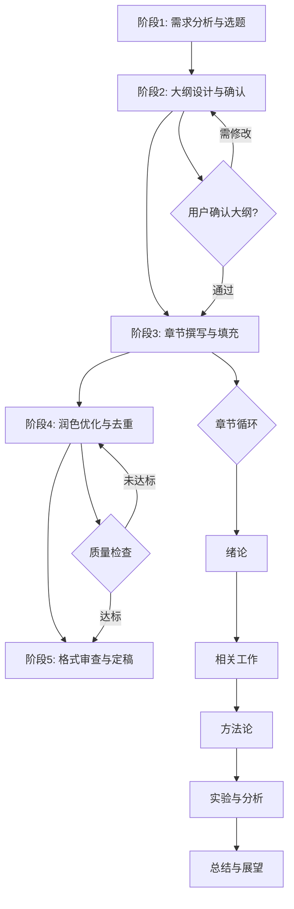

# Thesis-Writer: 学位论文智能撰写系统

## 🎯 何时使用此Skill / When to Use This Skill

**触发条件 / Trigger Conditions**:
- 当用户需要撰写计算机深度学习方向的硕士学位论文时
- 当用户需要基于河北大学LaTeX模板完成论文排版时
- 当用户需要系统化、专业化的论文写作指导时
- When users need to write a master's thesis in computer science deep learning
- When users need to complete thesis typesetting based on HBU LaTeX template
- When users need systematic and professional thesis writing guidance

**适用场景 / Applicable Scenarios**:
- ✅ 硕士学位论文的全流程撰写 / Full-process master's thesis writing
- ✅ 论文结构设计和大纲制定 / Thesis structure design and outline creation
- ✅ 学术规范的相关工作调研与对比 / Academic literature review and comparison
- ✅ 论文润色、去AI痕迹、降重优化 / Thesis polishing, AI detection removal, plagiarism reduction
- ✅ LaTeX格式调整和排版优化 / LaTeX formatting and typesetting optimization

---

## 🛠️ 核心能力 / Core Capabilities

### 能力矩阵 / Capability Matrix

| 能力 / Capability | 实现方式 / Implementation | 资源 / Resource |
|------------------|-------------------------|----------------|
| **论文大纲生成** | LLM + 知识引导 | `references/outline_templates.md` |
| **章节内容撰写** | LLM + 领域知识 | `references/writing_guide.md` |
| **相关工作搜集** | 脚本辅助 + LLM分析 | `scripts/paper_search.py` + `references/related_work_framework.md` |
| **LaTeX排版** | 脚本自动化 + 模板 | `scripts/latex_formatter.py` + HBU模板 |
| **去AI与降重** | LLM润色 + 脚本检测 | `scripts/ai_detector.py` + `references/paraphrasing_strategies.md` |
| **论文评审与修改** | LLM + 评审标准 | `references/review_checklist.md` |

---

## 📋 工作流程 / Workflow

### 核心五阶段流程 / Five-Phase Workflow



---

## 📝 详细工作流程 / Detailed Workflow

### 阶段1: 需求分析与选题 (Requirements Analysis & Topic Selection)

**目标**: 明确论文方向、研究内容、创新点

**互动问题清单**:

1. **研究方向细化**
   ```
   Q1: 你的研究是深度学习的哪个具体方向?
   - 计算机视觉 (CV)
   - 自然语言处理 (NLP)  
   - 推荐系统 (RecSys)
   - 图神经网络 (GNN)
   - 多模态学习 (Multimodal)
   - 其他: __________
   ```

2. **研究问题识别**
   ```
   Q2: 你要解决的核心问题是什么?
   - 用1-2句话描述你的研究motivation
   - 现有方法有什么不足?
   - 你的方法如何改进?
   ```

3. **已有成果盘点**
   ```
   Q3: 你目前已经有哪些材料?
   [ ] 已完成的实验结果
   [ ] 参考的论文列表
   [ ] 代码实现
   [ ] 初步的方法设计
   [ ] 其他: __________
   ```

4. **论文类型确定**
   ```
   Q4: 你的论文属于哪种类型?
   - 提出新方法/新模型
   - 改进现有方法
   - 综合性对比研究
   - 应用型研究
   ```

5. **时间规划**
   ```
   Q5: 论文完成时间要求?
   - 预期完成日期: __________
   - 答辩时间: __________
   ```

**输出**: 
- 📄 生成 `thesis_requirements.md`:包含研究方向、核心问题、创新点、时间规划
- 为后续大纲设计提供基础

---

### 阶段2: 大纲设计与确认 (Outline Design & Confirmation)

**目标**: 生成符合学术规范和学校要求的论文大纲

**执行步骤**:

**Step 2.1: 识别论文结构类型**

首先询问用户论文的组织方式:

```
Q: 你的论文包含几个独立的研究工作?

A. 单一工作: 一个核心方法 + 对应实验
   → 使用"单工作结构": 第3章方法 + 第4章实验

B. 双工作: 两个相关但独立的完整工作
   → 使用"双工作结构": 第3章工作1(含方法+实验) + 第4章工作2(含方法+实验)

C. 多工作: 三个及以上独立工作
   → 使用"多工作结构": 每章一个完整工作

请选择或说明你的情况。
```

**Step 2.2: 加载对应模板**
- 阅读 `references/outline_templates.md`
- 根据结构类型和论文类型选择合适模板

**Step 2.3: 生成初稿大纲**

#### 结构A: 单工作结构(传统结构)

基于河北大学硕士论文结构,生成包含以下章节的大纲:

```markdown
# [论文题目]

## 摘要 (Abstract)
- 中文摘要 (200-300字)
- 英文摘要 (200-300词)
- 关键词 (3-5个)

## 第1章 绪论
### 1.1 研究背景及意义
### 1.2 国内外研究现状
  #### 1.2.1 [子方向1]研究现状
  #### 1.2.2 [子方向2]研究现状
### 1.3 本文主要工作
### 1.4 论文组织结构

## 第2章 相关技术与理论基础
### 2.1 [基础技术1]
### 2.2 [基础技术2]
### 2.3 本章小结

## 第3章 [核心方法章节名称]
### 3.1 问题定义
### 3.2 整体框架
### 3.3 [模块1]设计
### 3.4 [模块2]设计
### 3.5 本章小结

## 第4章 实验设计与结果分析
### 4.1 实验设置
  #### 4.1.1 数据集
  #### 4.1.2 评价指标
  #### 4.1.3 实验环境与参数
### 4.2 对比实验
### 4.3 消融实验
### 4.4 结果分析与讨论
### 4.5 本章小结

## 第5章 总结与展望
### 5.1 研究工作总结
### 5.2 未来工作展望

## 参考文献

## 致谢

## 攻读学位期间取得的研究成果
```

#### 结构B: 双工作结构(知网常见结构)

**适用场景**: 论文包含两个相关但独立的完整工作,每个工作都有自己的方法设计、实验验证和结果分析。

```markdown
# [论文题目]

## 摘要 (Abstract)
- 中文摘要 (200-300字)
  - 背景 + 问题
  - 工作1简述 + 工作2简述
  - 实验结果 + 结论
- 英文摘要 (200-300词)
- 关键词 (3-5个)

## 第1章 绪论
### 1.1 研究背景及意义
### 1.2 国内外研究现状
  #### 1.2.1 [工作1相关]研究现状
  #### 1.2.2 [工作2相关]研究现状
  #### 1.2.3 现有方法的局限性
### 1.3 本文主要工作
  - 明确说明包含两个工作
  - 阐述两个工作的关系(递进/互补/并列)
### 1.4 论文组织结构

## 第2章 相关技术与理论基础
### 2.1 [两个工作共同的基础技术1]
### 2.2 [两个工作共同的基础技术2]
### 2.3 [评价指标与数据集]
### 2.4 本章小结

## 第3章 [工作1名称] (完整的独立工作)
### 3.1 引言
  - 工作1的具体问题和动机
  - 与工作2的关系说明
  
### 3.2 问题定义与分析
  - 形式化定义
  - 问题特点分析
  
### 3.3 [工作1方法名称]
  #### 3.3.1 整体框架
  #### 3.3.2 [核心模块1]设计
  #### 3.3.3 [核心模块2]设计
  #### 3.3.4 算法描述
  
### 3.4 实验设计与分析
  #### 3.4.1 实验设置
    - 数据集
    - 基线方法
    - 评价指标
    - 参数设置
  #### 3.4.2 对比实验结果
  #### 3.4.3 消融实验
  #### 3.4.4 可视化分析
  #### 3.4.5 结果讨论
  
### 3.5 本章小结
  - 总结工作1的贡献
  - 为工作2铺垫

## 第4章 [工作2名称] (完整的独立工作)
### 4.1 引言
  - 工作2的具体问题和动机
  - 基于工作1的改进/扩展/互补
  
### 4.2 问题定义与分析
  - 形式化定义
  - 与工作1的差异分析
  
### 4.3 [工作2方法名称]
  #### 4.3.1 整体框架
  #### 4.3.2 [核心模块1]设计
  #### 4.3.3 [核心模块2]设计
  #### 4.3.4 算法描述
  #### 4.3.5 (可选)与工作1的联合优化
  
### 4.4 实验设计与分析
  #### 4.4.1 实验设置
    - 数据集(可与工作1相同或不同)
    - 基线方法
    - 评价指标
    - 参数设置
  #### 4.4.2 对比实验结果
  #### 4.4.3 消融实验
  #### 4.4.4 可视化分析
  #### 4.4.5 与工作1的对比/联合效果
  #### 4.4.6 结果讨论
  
### 4.5 本章小结
  - 总结工作2的贡献
  - 总结两个工作的协同效果

## 第5章 总结与展望
### 5.1 研究工作总结
  - 分别总结工作1和工作2
  - 总结两个工作的整体贡献
### 5.2 未来工作展望
  - 工作1的改进方向
  - 工作2的扩展方向
  - 整体框架的优化方向

## 参考文献

## 致谢

## 攻读学位期间取得的研究成果
```

**双工作结构的关键点**:

1. **两个工作的关系类型**:
   - **递进关系**: 工作2基于工作1的结果进行改进
   - **互补关系**: 工作1和工作2从不同角度解决同一问题
   - **并列关系**: 工作1和工作2解决相关但独立的子问题

2. **章节组织原则**:
   - 每个工作都是"方法+实验"的完整闭环
   - 第3章和第4章结构对称,便于对比
   - 在各章引言和小结中说明两个工作的联系

3. **字数分配** (总计约40,000-50,000字):
   - 第1章: 8,000-10,000字
   - 第2章: 6,000-8,000字
   - 第3章: 12,000-15,000字 (工作1完整内容)
   - 第4章: 12,000-15,000字 (工作2完整内容)
   - 第5章: 2,000-3,000字

**Step 2.3: 大纲详细化**

为每个子节添加:
- **写作要点**: 该节应包含的核心内容
- **预计字数**: 建议的篇幅分配
- **参考资料**: 需要引用的论文/书籍

**Step 2.4: 用户确认与迭代**

```
📋 生成的大纲已保存到: outline.md

请审阅大纲,并回答:
1. 章节结构是否合理?
2. 是否需要添加/删除某些章节?
3. 章节命名是否准确反映内容?

如需修改,请指出具体调整建议。确认无误后,我们将进入内容撰写阶段。
```

**循环**: 根据用户反馈修改大纲,直到确认通过

**输出**:
- 📄 `outline.md`: 最终确认的详细大纲
- 📄 `writing_plan.md`: 章节写作顺序和时间分配计划

---

### 阶段3: 章节撰写与填充 (Chapter Writing & Content Filling)

**目标**: 按大纲逐章节完成高质量内容撰写

**写作顺序建议**:
1. 第2章 (相关技术) → 奠定理论基础
2. 第3章 (核心方法) → 技术贡献核心
3. 第4章 (实验分析) → 验证方法有效性
4. 第1章 (绪论) → 在对工作全面了解后撰写
5. 第5章 (总结展望) → 最后总结
6. 摘要 → 全文完成后提炼

---

#### 3.1 第1章: 绪论撰写

**Step 3.1.1: 研究背景与意义**

**指导原则** (参考 `references/writing_guide.md`):
- 从宏观到微观: 领域背景 → 具体问题
- 问题的重要性和紧迫性
- 解决该问题的价值

**示例结构**:
```
1. 领域大背景 (2-3段)
   - 深度学习在XX领域的发展
   - 当前应用现状

2. 具体问题引出 (2-3段)
   - 现有方法存在的局限
   - 问题的挑战性

3. 研究意义 (1-2段)
   - 理论意义
   - 应用价值
```

**AI辅助撰写**:
```
基于你的研究方向: [从阶段1获取]
我将为你生成研究背景初稿。

生成中... 

初稿已生成,请审阅:
[展示生成的内容]

请提供反馈:
- 是否准确反映你的研究?
- 哪些部分需要调整?
- 是否需要补充具体案例?
```

**Step 3.1.2: 国内外研究现状**

**调研辅助**:

使用 `scripts/paper_search.py` 搜集相关论文:

```bash
python scripts/paper_search.py \
  --query "your research keywords" \
  --venue "NeurIPS,ICML,ICLR,CVPR,ACL" \
  --years "2020-2024" \
  --output related_papers.json
```

**分类整理**:

加载 `references/related_work_framework.md` 获取综述框架:

```markdown
将相关工作分为3-4个子方向:

### 1.2.1 [子方向1: 如"基于注意力机制的方法"]
- 代表工作1 [引用]: 简述贡献
- 代表工作2 [引用]: 简述贡献
- 小结: 这类方法的优势与不足

### 1.2.2 [子方向2: 如"基于图神经网络的方法"]
...

### 1.2.3 [子方向3: 如"多模态融合方法"]
...

总结: 现有方法的共性问题,引出本文工作的必要性
```

**对比表格生成**:

```latex
\begin{table}[htbp]
  \centering
  \caption{相关工作对比}
  \begin{tabular}{cccc}
    \toprule
    方法 & 核心技术 & 优势 & 局限 \\
    \midrule
    方法1 \cite{ref1} & XXX & ... & ... \\
    方法2 \cite{ref2} & XXX & ... & ... \\
    本文方法 & XXX & ... & - \\
    \bottomrule
  \end{tabular}
  \label{tab:related_work_comparison}
\end{table}
```

**Step 3.1.3: 本文主要工作**

**写作重点**:
- 针对性: 针对1.2节指出的问题
- 创新性: 明确说明创新点(3-5个)
- 贡献点: 列举具体贡献

**模板**:
```
针对上述问题,本文提出了[方法名称],主要工作包括:

(1) [创新点1]: 简述内容和意义

(2) [创新点2]: 简述内容和意义

(3) [创新点3]: 简述内容和意义

本文的主要贡献如下:
• 贡献1: ...
• 贡献2: ...
• 贡献3: ...
```

---

#### 3.2 第2章: 相关技术与理论基础

**目标**: 介绍后续章节需要的预备知识

**原则**:
- 只介绍必要的基础知识,不要写成教科书
- 每个技术/概念要有明确的作用(在后文哪里用到)

**内容组织**:

```markdown
### 2.1 [基础技术1: 如"深度神经网络"]
#### 2.1.1 基本原理
- 数学定义
- 核心公式

#### 2.1.2 典型架构
- CNN/RNN/Transformer等(按需选择)

### 2.2 [基础技术2: 如"注意力机制"]
#### 2.2.1 自注意力机制
#### 2.2.2 交叉注意力机制

### 2.3 [相关评价指标]
- 介绍实验章节会用到的评价指标
```

**公式排版规范**:

```latex
% 带编号公式
\begin{equation}
\text{Attention}(Q, K, V) = \text{softmax}\left(\frac{QK^T}{\sqrt{d_k}}\right)V
\label{eq:attention}
\end{equation}

% 多行公式
\begin{align}
h_t &= \sigma(W_h x_t + U_h h_{t-1} + b_h) \label{eq:hidden} \\
y_t &= \text{softmax}(W_y h_t + b_y) \label{eq:output}
\end{align}
```

---

#### 3.3 第3章: 核心方法章节

**这是论文的核心,需要最详细的设计**

**Step 3.3.1: 问题定义**

**形式化描述**:
```latex
\textbf{定义3.1 (问题定义):} 
给定输入数据集 $\mathcal{D} = \{(x_i, y_i)\}_{i=1}^{N}$, 
其中 $x_i \in \mathbb{R}^{d}$ 为特征向量, $y_i \in \mathcal{Y}$ 为标签,
本文旨在学习映射函数 $f: \mathbb{R}^{d} \rightarrow \mathcal{Y}$,
使得预测误差 $\mathcal{L}(f(x), y)$ 最小。
```

**Step 3.3.2: 整体框架**

**架构图绘制**:

使用TikZ或其他工具绘制系统架构图:

```latex
\begin{figure}[htbp]
  \centering
  \includegraphics[width=0.9\textwidth]{figures/framework.pdf}
  \caption{[方法名称]整体框架}
  \label{fig:framework}
\end{figure}
```

**文字描述**:
```
如图\ref{fig:framework}所示,本文提出的XXX方法主要包括三个模块:

1. 数据预处理模块: 负责...
2. 特征提取模块: 通过...
3. 预测模块: 最终...

各模块协同工作,完成从输入到输出的完整流程。
```

**Step 3.3.3 & 3.3.4: 核心模块详细设计**

**每个模块应包含**:
- **动机**: 为什么需要这个模块
- **设计思路**: 如何实现
- **数学描述**: 公式化表达
- **算法伪代码**: 关键算法

**算法伪代码示例**:

```latex
\begin{algorithm}[h]
\caption{[算法名称]}
\label{alg:main}
\begin{algorithmic}[1]
\Require 输入数据 $X$, 参数 $\theta$
\Ensure 输出结果 $Y$

\State \textbf{初始化:} $h_0 = \mathbf{0}$
\For{$t=1$ to $T$}
  \State $h_t = f_{\theta}(x_t, h_{t-1})$  \Comment{特征提取}
  \State $\alpha_t = \text{Attention}(h_t, H)$  \Comment{注意力计算}
  \State $c_t = \sum_{i=1}^{t} \alpha_{t,i} h_i$  \Comment{上下文聚合}
\EndFor
\State $y = g_{\theta}(c_T)$  \Comment{输出预测}
\State \textbf{返回:} $y$
\end{algorithmic}
\end{algorithm}
```

**复杂度分析**:
```
时间复杂度: O(...)
空间复杂度: O(...)
```

---

#### 3.4 第4章: 实验设计与结果分析

**Step 3.4.1: 实验设置**

**数据集介绍**:
```markdown
#### 4.1.1 数据集
本文在以下X个公开数据集上进行实验:

1. **数据集1**: 
   - 来源: [引用]
   - 规模: XX个样本
   - 特点: ...
   - 划分: 训练/验证/测试 = 80%/10%/10%

2. **数据集2**: ...
```

**评价指标**:
```latex
采用以下评价指标:

\textbf{准确率 (Accuracy):}
\begin{equation}
\text{Acc} = \frac{\text{正确预测数}}{\text{总样本数}}
\end{equation}

\textbf{F1分数:}
\begin{equation}
F1 = 2 \cdot \frac{\text{Precision} \cdot \text{Recall}}{\text{Precision} + \text{Recall}}
\end{equation}
```

**实验环境与参数**:
```markdown
#### 4.1.3 实验环境与参数
- 硬件: NVIDIA RTX 3090 (24GB)
- 软件: Python 3.8, PyTorch 2.0
- 超参数设置:
  - 学习率: 1e-4
  - Batch size: 32
  - Epoch: 100
  - 优化器: AdamW
```

**Step 3.4.2: 对比实验**

**Baseline选择**:
- 选择3-5个有代表性的SOTA方法
- 说明选择理由

**结果表格**:

```latex
\begin{table}[htbp]
  \centering
  \caption{不同方法在XX数据集上的性能对比}
  \begin{tabular}{lcccc}
    \toprule
    方法 & Acc(\%) & Precision(\%) & Recall(\%) & F1(\%) \\
    \midrule
    Baseline1 \cite{ref1} & 85.3 & 84.2 & 86.1 & 85.1 \\
    Baseline2 \cite{ref2} & 87.1 & 86.5 & 87.8 & 87.1 \\
    Baseline3 \cite{ref3} & 88.4 & 87.9 & 88.9 & 88.4 \\
    \textbf{Ours} & \textbf{91.2} & \textbf{90.5} & \textbf{91.8} & \textbf{91.1} \\
    \bottomrule
  \end{tabular}
  \label{tab:main_results}
\end{table}
```

**结果分析**:
```
从表\ref{tab:main_results}可以看出:
(1) 本文方法在所有指标上均优于基线方法
(2) 相比最佳基线Baseline3,本文方法在Acc上提升了2.8个百分点
(3) 这验证了[核心创新点]的有效性
```

**Step 3.4.3: 消融实验**

**目的**: 验证各模块的贡献

```latex
\begin{table}[htbp]
  \centering
  \caption{消融实验结果}
  \begin{tabular}{lc}
    \toprule
    模型变体 & Acc(\%) \\
    \midrule
    完整模型 & \textbf{91.2} \\
    \quad - 移除模块A & 88.7 (-2.5) \\
    \quad - 移除模块B & 89.3 (-1.9) \\
    \quad - 移除模块A和B & 86.1 (-5.1) \\
    \bottomrule
  \end{tabular}
  \label{tab:ablation}
\end{table}
```

**分析**:
```
消融实验表明:
(1) 移除任一模块都会导致性能下降
(2) 模块A的贡献最大(下降2.5个百分点)
(3) 两个模块协同作用,带来5.1个百分点的提升
```

**Step 3.4.4: 可视化分析**

**注意力可视化/特征可视化等**:

```latex
\begin{figure}[htbp]
  \centering
  \includegraphics[width=0.8\textwidth]{figures/attention_vis.pdf}
  \caption{注意力权重可视化}
  \label{fig:attention_vis}
\end{figure}
```

---

#### 3.5 第5章: 总结与展望

**Step 3.5.1: 研究工作总结**

**模板**:
```
本文针对[研究问题],提出了[方法名称]。
主要完成了以下工作:

(1) [工作1总结]
(2) [工作2总结]
(3) [工作3总结]

实验结果表明,[核心结论],验证了本文方法的有效性。
```

**Step 3.5.2: 未来工作展望**

**方向**:
- 方法改进方向
- 应用拓展可能
- 理论分析深化

```
未来将在以下方向继续研究:
(1) [方向1]: 具体内容...
(2) [方向2]: 具体内容...
```

---

#### 3.6 摘要撰写

**在全文完成后撰写**

**中文摘要结构** (200-300字):
```
[背景1-2句] + [问题1句] + [方法2-3句] + [实验结果1-2句] + [结论1句]
```

**英文摘要**:
- 对中文摘要的准确翻译
- 注意学术英语表达规范

**关键词选择**:
- 3-5个
- 包含: 领域术语 + 方法名称 + 应用场景

---

### 章节撰写的通用规范

**每撰写完一章**:

1. **自查清单**:
   ```
   [ ] 逻辑连贯,无跳跃
   [ ] 公式推导正确
   [ ] 图表清晰,有caption和label
   [ ] 引用格式正确
   [ ] 段落间有过渡
   [ ] 每节有小结
   ```

2. **用户审阅**:
   ```
   第X章初稿已完成,请审阅:
   
   [展示章节内容摘要]
   
   请确认:
   1. 内容是否符合预期?
   2. 技术细节是否准确?
   3. 是否需要补充内容?
   
   确认后将进入下一章节撰写。
   ```

**输出 (阶段3完成时)**:
- 📄 各章节的LaTeX源文件
- 📄 `references.bib`: 参考文献BibTeX文件
- 📄 生成的图表文件

---

### 阶段4: 润色优化与去重 (Polishing & Optimization)

**目标**: 提升论文质量,去除AI痕迹,降低查重率

#### 4.1 内容润色

**Step 4.1.1: 语言润色**

**关注点**:
- 学术规范性: 避免口语化表达
- 逻辑连贯性: 段落间过渡自然
- 表达准确性: 避免模糊表述

**示例对比**:
```
❌ "这个方法很好" 
✅ "该方法在准确率和效率上均表现出色"

❌ "我们做了实验"
✅ "本文在X个数据集上进行了对比实验"
```

**AI辅助润色**:
```
逐段审阅内容,提供润色建议:

原文: [段落内容]
润色: [改进后内容]
理由: [修改原因]

请确认是否采纳。
```

**Step 4.1.2: 逻辑优化**

**检查项**:
- [ ] 章节之间的逻辑链条清晰
- [ ] 问题-方法-验证形成闭环
- [ ] 创新点与实验设计对应
- [ ] 结论与实验结果一致

---

#### 4.2 去AI痕迹

**目标**: 让论文更具人类写作特征

**策略** (参考 `references/paraphrasing_strategies.md`):

**策略1: 改写高风险表达**

AI常用表达 → 学术化改写:
```
"值得注意的是" → "需要指出"
"显著提升" → "提高了X个百分点"
"深入分析" → "详细考察"
```

**策略2: 增加领域特定表达**

加入本领域的专业术语和表达习惯:
```
通用: "模型性能更好"
专业: "模型在收敛速度和泛化能力上均有所提升"
```

**策略3: 丰富句式结构**

避免句式单一:
```
❌ 连续多句"本文...本文...本文..."
✅ 变换主语和句式: "为了...""考虑到...""基于..."
```

**AI检测工具使用**:

```bash
python scripts/ai_detector.py --input thesis.tex --output report.json
```

输出报告会标注高风险段落,针对性修改。

---

#### 4.3 查重与降重

**Step 4.3.1: 重复率检查**

**工具**:
- 学校指定的查重系统
- 提前自查: PaperPass/维普等

**Step 4.3.2: 降重策略**

**方法** (参考 `references/paraphrasing_strategies.md`):

1. **同义替换**:
   ```
   原: "该方法能够有效提升模型性能"
   改: "该方法可显著改善模型表现"
   ```

2. **句式重构**:
   ```
   原: "深度学习在计算机视觉领域得到了广泛应用"
   改: "计算机视觉领域广泛采用深度学习技术"
   ```

3. **主动被动转换**:
   ```
   原: "本文提出了一种新方法"
   改: "一种新方法在本文中被提出"
   ```

4. **扩展或压缩**:
   ```
   原: "使用注意力机制"
   扩展: "引入注意力机制以捕捉长距离依赖关系"
   ```

5. **公式化表达**:
   ```
   原: "计算两个向量的相似度"
   改: "计算相似度 $s = \text{cos}(v_1, v_2)$"
   ```

**辅助工具**:

```bash
python scripts/paraphrase_assistant.py \
  --input high_similarity_segments.txt \
  --output suggestions.txt
```

**人工审核**: AI提供改写建议,用户确认是否采纳

---

#### 4.4 专业审阅

**Step 4.4.1: 自动检查**

运行检查脚本:
```bash
python scripts/thesis_checker.py --input thesis.tex
```

**检查内容**:
- [ ] 引用格式一致性
- [ ] 图表编号连续性
- [ ] 公式编号正确性
- [ ] 章节交叉引用有效性
- [ ] 拼写和语法错误

**Step 4.4.2: 按评审标准审核**

加载 `references/review_checklist.md`,按标准逐项检查:

**学术规范**:
- [ ] 引用充分,无遗漏关键文献
- [ ] 实验设置完整,可复现
- [ ] 创新点表述明确

**写作质量**:
- [ ] 语言流畅,无语病
- [ ] 逻辑清晰,层次分明
- [ ] 图表规范,辅助说明到位

**技术深度**:
- [ ] 方法描述详细,有公式和算法
- [ ] 实验充分,包含对比和消融
- [ ] 分析深入,不仅陈述结果

**输出**:
- 📄 `polishing_report.md`: 润色和去重报告
- 📄 优化后的LaTeX文件

---

### 阶段5: 格式审查与定稿 (Format Review & Finalization)

**目标**: 确保论文完全符合河北大学模板规范

#### 5.1 LaTeX格式检查

**Step 5.1.1: 模板规范对照**

基于 `HBUthesis.cls` 和 `HBUthesis.tex` 模板:

**封面信息**:
```latex
% 检查项
[ ] 学校代码: 10075
[ ] 学号: 正确填写
[ ] 论文题目: 中英文一致
[ ] 学位申请人姓名
[ ] 指导教师信息
[ ] 专业学位类别: 工程硕士
[ ] 专业学位领域: 软件工程
[ ] 院系名称
[ ] 答辩日期: 格式正确
```

**摘要格式**:
```latex
% 中文摘要
\begin{cnabstract}
[摘要正文]
\par\noindent\heiti{关键字\ } \songti 关键字1\quad 关键字2\quad 关键字3
\end{cnabstract}

% 英文摘要
\begin{enabstract}
[Abstract content]
\par\noindent\textbf{Keywords\ } Keyword1\quad Keyword2\quad Keyword3
\end{enabstract}
```

**章节格式**:
```latex
\chapter{章节标题}  % 第一级
\section{节标题}     % 第二级
\subsection{小节标题} % 第三级
```

**图表格式**:
```latex
% 图片
\begin{figure}[htbp]
  \centering
  \includegraphics[width=0.8\textwidth]{figure.pdf}
  \caption{图片标题}
  \label{fig:label}
\end{figure}

% 表格 (三线表)
\begin{table}[htbp]
  \centering
  \caption{表格标题}
  \begin{tabular}{cccc}
    \toprule
    ... \\
    \midrule
    ... \\
    \bottomrule
  \end{tabular}
  \label{tab:label}
\end{table}
```

**公式格式**:
```latex
% 单个公式
\begin{equation}
  formula
  \label{eq:label}
\end{equation}

% 多行公式
\begin{align}
  line1 \label{eq:label1} \\
  line2 \label{eq:label2}
\end{align}
```

**参考文献**:
```latex
\bibliography{references}
% 确保 references.bib 格式正确
```

**Step 5.1.2: 自动化格式检查**

```bash
python scripts/latex_formatter.py \
  --template HBUthesis \
  --input thesis.tex \
  --check-only \
  --output format_report.txt
```

**Step 5.1.3: 格式修正**

根据检查报告,修正格式问题:

```bash
python scripts/latex_formatter.py \
  --template HBUthesis \
  --input thesis.tex \
  --auto-fix \
  --output thesis_formatted.tex
```

---

#### 5.2 编译与输出

**Step 5.2.1: LaTeX编译**

```bash
# 完整编译流程
xelatex thesis.tex
bibtex thesis
xelatex thesis.tex
xelatex thesis.tex
```

**Step 5.2.2: 检查编译输出**

- [ ] PDF正常生成
- [ ] 无编译错误
- [ ] 目录生成正确
- [ ] 参考文献显示正常
- [ ] 图表编号无误
- [ ] 交叉引用有效

**Step 5.2.3: PDF质量检查**

- [ ] 字体嵌入正确
- [ ] 图片清晰度足够
- [ ] 页边距符合要求
- [ ] 页眉页脚正确

---

#### 5.3 最终审核

**全文通读**:
- 打印或在大屏幕上阅读
- 检查整体连贯性
- 查找遗漏的错误

**盲审模拟**:
```
按照评审标准,模拟盲审评分:

1. 选题与创新 (20分): __/20
2. 理论基础 (15分): __/15
3. 研究方法 (20分): __/20
4. 研究成果 (25分): __/25
5. 写作质量 (10分): __/10
6. 规范性 (10分): __/10

总分: __/100

不足之处: [列出]
改进建议: [列出]
```

---

#### 5.4 生成最终版本

**输出文件清单**:
```
thesis_final/
├── thesis.pdf                 # 最终PDF
├── thesis.tex                # 主文件
├── chapters/                 # 章节文件
│   ├── chapter1.tex
│   ├── chapter2.tex
│   ├── ...
├── figures/                  # 图片文件
├── references.bib           # 参考文献
└── HBUthesis.cls            # 模板文件
```

**版本记录**:
```
thesis_versions/
├── v1.0_initial_draft.pdf
├── v2.0_after_polishing.pdf
├── v3.0_final.pdf
└── version_log.md
```

**提交准备**:
- [ ] 生成独创性声明和授权书
- [ ] 准备Word版摘要 (如需要)
- [ ] 准备答辩PPT大纲

---

## 🔧 工具与脚本 / Tools & Scripts

### `scripts/paper_search.py` - 论文搜索工具

**用途**: 从学术数据库搜索相关论文

**使用**:
```bash
python scripts/paper_search.py \
  --query "deep learning attention mechanism" \
  --venue "NeurIPS,ICML,CVPR" \
  --years "2020-2024" \
  --max-results 50 \
  --output papers.json
```

**输出格式**:
```json
{
  "papers": [
    {
      "title": "...",
      "authors": ["...", "..."],
      "venue": "NeurIPS",
      "year": 2023,
      "abstract": "...",
      "url": "...",
      "bibtex": "..."
    }
  ]
}
```

---

### `scripts/latex_formatter.py` - LaTeX格式化工具

**用途**: 检查和修正LaTeX格式

**使用**:
```bash
# 仅检查
python scripts/latex_formatter.py --input thesis.tex --check-only

# 自动修正
python scripts/latex_formatter.py --input thesis.tex --auto-fix --output thesis_fixed.tex
```

---

### `scripts/ai_detector.py` - AI痕迹检测工具

**用途**: 检测论文中的AI生成痕迹

**使用**:
```bash
python scripts/ai_detector.py --input thesis.tex --output ai_report.json
```

**输出**: 标注高风险段落和修改建议

---

### `scripts/paraphrase_assistant.py` - 改写助手

**用途**: 辅助降重改写

**使用**:
```bash
python scripts/paraphrase_assistant.py \
  --input high_similarity.txt \
  --style academic \
  --output suggestions.txt
```

---

### `scripts/thesis_checker.py` - 论文完整性检查

**用途**: 全面检查论文质量

**使用**:
```bash
python scripts/thesis_checker.py --input thesis.tex --output check_report.md
```

**检查项**:
- 结构完整性
- 引用一致性
- 图表编号
- 拼写语法
- 格式规范

---

## 📚 参考资源 / References

### `references/outline_templates.md`
**内容**: 不同类型论文的大纲模板
- 方法创新型论文大纲
- 综述型论文大纲
- 应用型论文大纲

**何时加载**: 阶段2生成大纲时

---

### `references/writing_guide.md`
**内容**: 学术写作规范和技巧
- 各章节写作重点
- 学术语言规范
- 常见写作错误

**何时加载**: 阶段3章节撰写时

---

### `references/related_work_framework.md`
**内容**: 相关工作综述框架
- 文献分类方法
- 对比表格模板
- 综述撰写技巧

**何时加载**: 撰写第1.2节时

---

### `references/latex_guide.md`
**内容**: LaTeX使用指南
- 河北大学模板使用说明
- 常用LaTeX命令
- 图表公式排版技巧

**何时加载**: 阶段5格式调整时

---

### `references/paraphrasing_strategies.md`
**内容**: 改写和降重策略
- 同义替换词库
- 句式重构方法
- 学术表达改进

**何时加载**: 阶段4降重优化时

---

### `references/review_checklist.md`
**内容**: 论文评审标准
- 学术规范检查项
- 技术深度评估
- 写作质量标准

**何时加载**: 阶段4和阶段5审核时

---

## 💡 使用示例 / Usage Example

### 完整流程示例

**用户**: 
```
我需要写一篇关于多模态情感分析的硕士论文,
使用Transformer和图神经网络结合的方法。
```

**AI (启动 thesis-writer)**:

**阶段1: 需求分析**
```
让我们开始梳理你的论文需求。

Q1: 研究方向细化
你的研究是: 
☑ 多模态学习 (Multimodal) - 情感分析方向

Q2: 核心问题
请用1-2句话描述:
```

**用户回答后...**

**阶段2: 生成大纲**
```
基于你的研究方向,我生成了初步大纲:

# 基于Transformer和图神经网络的多模态情感分析

## 第1章 绪论
### 1.1 研究背景及意义
### 1.2 国内外研究现状
  #### 1.2.1 基于Transformer的情感分析方法
  #### 1.2.2 基于图神经网络的多模态融合
  #### 1.2.3 多模态情感分析研究现状
### 1.3 本文主要工作
### 1.4 论文组织结构

...

[完整大纲]

请审阅并确认,或提出修改建议。
```

**确认后,进入阶段3撰写...**

---

## ⚙️ Token优化策略 / Token Optimization

**渐进式加载原则**:
1. **阶段1-2**: 仅加载大纲模板 (~800 tokens)
2. **阶段3**: 按需加载章节写作指南 (~1000 tokens/章)
3. **阶段4**: 加载润色和降重策略 (~1200 tokens)
4. **阶段5**: 加载格式检查规范 (~600 tokens)

**避免冗余**:
- 不同时加载所有references
- 完成的章节内容归档,不重复加载
- 使用脚本处理确定性任务,节省LLM tokens

---

## ⚠️ 限制与注意事项 / Limitations & Notes

**已知限制**:

1. **技术内容准确性**: 
   - AI生成的技术细节需用户验证
   - 特定领域的公式推导需人工审核

2. **创新性判断**:
   - AI无法判断创新点是否已被发表
   - 需用户补充最新文献调研

3. **实验结果**:
   - AI无法生成真实实验数据
   - 需用户提供实验结果,AI辅助分析和撰写

4. **查重系统差异**:
   - 不同查重系统结果可能不同
   - 以学校指定系统为准

**最佳实践**:

- ✅ **分阶段确认**: 每阶段完成后与用户确认
- ✅ **用户主导**: 技术内容由用户把关,AI辅助表达
- ✅ **迭代优化**: 允许多轮修改完善
- ✅ **版本管理**: 保留各版本,便于回溯

---

## 📦 依赖 / Dependencies

**Python依赖**:

`requirements.txt`:
```txt
# 论文搜索
scholarly>=1.7.0
arxiv>=1.4.0

# LaTeX处理
pylatexenc>=2.10

# 文本处理
nltk>=3.8
jieba>=0.42

# 其他工具
requests>=2.28.0
beautifulsoup4>=4.11.0
```

**LaTeX依赖**:
- XeLaTeX编译器
- 河北大学论文模板 (HBUthesis.cls)
- 中文字体: 宋体、黑体、仿宋、楷体

---

## 🗂️ 文件结构 / File Structure

```
thesis-writer/
├── SKILL.md                          # 本文件
├── requirements.txt                  # Python依赖
├── scripts/                          # 工具脚本
│   ├── paper_search.py              # 论文搜索
│   ├── latex_formatter.py           # LaTeX格式化
│   ├── ai_detector.py               # AI痕迹检测
│   ├── paraphrase_assistant.py      # 改写助手
│   └── thesis_checker.py            # 论文检查
├── references/                       # 参考文档
│   ├── outline_templates.md         # 大纲模板
│   ├── writing_guide.md             # 写作指南
│   ├── related_work_framework.md    # 综述框架
│   ├── latex_guide.md               # LaTeX指南
│   ├── paraphrasing_strategies.md   # 改写策略
│   └── review_checklist.md          # 评审标准
└── templates/                        # 模板文件
    └── HBUthesis/                   # 河北大学模板
        ├── HBUthesis.cls
        ├── HBUthesis.tex
        └── ...
```

---

**开始使用**: 告诉我你的研究方向和论文需求,让我们一起完成高质量的学位论文!

**Get Started**: Tell me your research direction and thesis requirements, let's create a high-quality thesis together!
